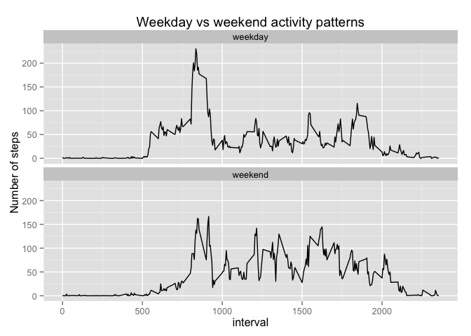

# Reproducible Research: Peer Assessment 1
<br><br>


## Loading and preprocessing the data   
<br>
After downloading and saving the zip file in the current working directory, we
extract the activity monitoring data stored in the activity.csv file. We then 
load the dataset into a tbl_df data frame. Finally, we convert the 'date' 
column from factor type to date type.
<br><br>

```r
library(lubridate)
library(dplyr)

file <- 'activity.csv'
tdf <- tbl_df(read.csv(file))  # tdf = table data frame
tdf$date <- ymd(tdf$date)  # convert factor to POSIXct date type
```
<br><br>

We output some basic summary data just in case something happens to the CSV file 
so the person reviewing this report can quickly assess whether or not the data
source is the same before even starting to look into all the details of the 
analysis.
<br><br>

```r
str(tdf)
```

```
## Classes 'tbl_df', 'tbl' and 'data.frame':	17568 obs. of  3 variables:
##  $ steps   : int  NA NA NA NA NA NA NA NA NA NA ...
##  $ date    : POSIXct, format: "2012-10-01" "2012-10-01" ...
##  $ interval: int  0 5 10 15 20 25 30 35 40 45 ...
```

```r
summary(tdf)
```

```
##      steps            date               interval   
##  Min.   :  0.0   Min.   :2012-10-01   Min.   :   0  
##  1st Qu.:  0.0   1st Qu.:2012-10-16   1st Qu.: 589  
##  Median :  0.0   Median :2012-10-31   Median :1178  
##  Mean   : 37.4   Mean   :2012-10-31   Mean   :1178  
##  3rd Qu.: 12.0   3rd Qu.:2012-11-15   3rd Qu.:1766  
##  Max.   :806.0   Max.   :2012-11-30   Max.   :2355  
##  NA's   :2304
```
<br><br><br>

## What is the mean total number of steps taken per day?   
<br>
We create a histogram of the total number of steps taken each day after 
discarding any row with a 'NA' value in the 'steps' column.   
<br>

```r
# tsd = total steps per day
tsd <- tdf %>% group_by(date) %>% summarize(total_steps_day = sum(steps, na.rm = TRUE))  
hist(tsd$total_steps_day, main = 'Histogram of total steps each day', xlab = 'Total steps')
```

 
<br><br>

The code used to produce the mean and median is:
<br><br>

```r
# note that NAs have already been removed by the code above in the call to sum()
# mmd = mean median across days
mmd <- tsd %>% summarize(mean = mean(total_steps_day), median = median(total_steps_day))  
```
<br><br>
The **mean** total number of steps taken per day is **9354.2295** and the **median** total number 
of steps taken per day is **10395**.  
<br><br><br>

## What is the average daily activity pattern?
<br>
The plot showing the daily average number of steps for each interval (averaged across all days) is 
produced by the following code:   
<br>

```r
# work only with non-missing values
ctdf <- complete.cases(tdf)  # ctdf = complete table data frame
# iads = interval average daily steps; davg = daily average
iads <- tdf[ctdf, ] %>% group_by(interval) %>% summarize(davg = mean(steps))  
plot(iads$interval, iads$davg, 
     type = 'l', main = 'Avg Daily Activity', xlab = '5-min interval', ylab = 'Avg Steps')
```

 

<br>

```r
max_interval <- iads[max(iads$davg) == iads$davg, 'interval']
```
The 5-minute interval that contains the maximum number of steps on average across all days in the 
dataset is **835**.
<br><br><br>

## Imputing missing values
<br>
The following code displays the total number of rows in the dataset that contain at least 1 missing 
value.
<br><br>

```r
totalNAs <- sum(is.na(tdf))
```
<br>
The total number of rows missing some values thus is **2304**.
<br><br>
The strategy we will use to fill in all the missing values consists in taking the average number of 
steps for a particular interval over the whole period under consideration and use that value in lieu 
of the missing one. These averages are already available as they have been computed above and stored 
in the 'iads' variable. For convenience, we repeat the code here:
<br><br>

```r
iads <- tdf[ctdf, ] %>% group_by(interval) %>% summarize(davg = mean(steps))
```
<br><br>
We now create a new dataset equal to the original one but with the missing data filled in. To do so 
efficiently, we need the data.table package.
<br><br>

```r
# use data.table for in place mutation as it's more elegant than a bunch of loops and avoids more 
# awkward and convoluted syntax (the S people didn't know how to design a programming language 
# properly; what a shame)
library(data.table)

dt <- as.data.table(tdf)
dt$steps <- as.numeric(dt$steps)
# using data.table syntax, we test for the condition and if true, directly assign 
# the new value by reference
dt[is.na(steps) & interval %in% iads$interval, steps := iads$davg]   
```

```
## Source: local data frame [17,568 x 3]
## 
##      steps       date interval
## 1  1.71698 2012-10-01        0
## 2  0.33962 2012-10-01        5
## 3  0.13208 2012-10-01       10
## 4  0.15094 2012-10-01       15
## 5  0.07547 2012-10-01       20
## 6  2.09434 2012-10-01       25
## 7  0.52830 2012-10-01       30
## 8  0.86792 2012-10-01       35
## 9  0.00000 2012-10-01       40
## 10 1.47170 2012-10-01       45
## ..     ...        ...      ...
```
<br><br>
We now make a new histogram of the total number of steps taken each day.
<br><br>

```r
# since NAs have been removed, for efficiency no need to use na.rm arg
ntsd <- dt %>% group_by(date) %>% summarize(total_steps_day = sum(steps)) 
hist(ntsd$total_steps_day, main = 'Histogram of total steps each day (no NAs)', xlab = 'Total steps')
```

 
<br><br>

Finally, we compute the mean and median again but this time based on the new values used 
to replace NAs:
<br><br>

```r
# nmmd = new mean median across days
nmmd <- ntsd %>% summarize(mean = mean(total_steps_day), median = median(total_steps_day))
```
<br><br>
The new **mean** total number of steps taken per day is **10766.1887** and the new **median** total 
number of steps taken per day is **10766.1887**.  Interestingly, these values are quite different 
from the previous estimates. It appears that the impact of imputing missing data affects the skew of 
the distribution.
<br><br><br>


## Are there differences in activity patterns between weekdays and weekends?
<br>
To explore whether or not there are differences in activity patterns between weekdays and weekends, we 
first create 2 factors to categorize days by their type, namely: 'weekday' and 'weekend'.  Then we 
group over intervals and day types, and compute the mean for each interval by each day type. Finally, 
we plot the result with qplot.
<br><br>

```r
library(ggplot2)
# dt = data.table
dt$daytype <- as.factor(ifelse(weekdays(dt$date) %in% c('Saturday', 'Sunday'), 'weekend', 'weekday'))  
iads_by_daytype <- dt %>% group_by(interval, daytype) %>% summarize(davg = mean(steps))
qplot(interval, davg, data = iads_by_daytype, 
      geom = 'path', 
      main = 'Weekday vs weekend activity patterns', 
      ylab = 'Number of steps') + facet_wrap(~ daytype, nrow = 2)
```

 
<br><br>
We can see from the plot that there are indeed differences in activity between week days and weekends. 
For instance, there is more activity on week days than on weekends during the hours preceding 10 am, 
whereas on the weekend activity surpasses that of week days between 10 am and 4 pm, or thereabouts. 
Presumably people sit more during the week because of work, and on the weekend since they are not so 
constrained, they move about more in the afternoon while they sleep more in the morning.
<br><br>
